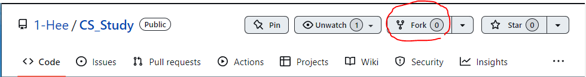

# `CS 면접 대비 스터디 `

### 1. 스터디  개요
-   매주 하나의 CS 주제에 대한 면접 질문과 답변을 정리해서 공유하는 스터디

### 2. 참여 인원
|조원희(1-hee)|안효관()|한재윤()|
|---|---|---|
| |  |  |

### 3. 교재 및 강의
-  구글(Google)

### 4. 스터디 목표
- 면접에서 나올 수 있는 다양한 질문을 기반으로 실제 면접처럼 대비 (공부 -> 면접)
- 스터디를 통해 CS 기초 지식을 기반을 다지며 서로 동기를 부여함
- 이번 주도 열심히 살았다! 갓생을 위한 알찬 스터디

### 5. 커리큘럼
### `스터디 기간 : 6주`
### `학습 목차`

프로그래밍 일반

- 프로그래밍 패러다임
- 객체지향 프로그래밍(OOP)
- REST API
- GIT & GITHUB
- 개발 방법론
- 디자인 패턴
- 비동기 처리
- 프레임워크 vs 라이브러리

자료구조

    1.  Array, Vector, Linked list
    2.  Stack, Queue
    3.  Deque
    4.  Priority Queue, Heqp
    5.  Hash
    6.  Graph
    7.  Tree
    8.  Tree
    9.  union-find 

알고리즘

    1.  시간복잡도
    2.  정렬(버블/선택/퀵/병합/삽입)
    3.  재귀
    4.  dp
    5.  그래프 기초(dfs bfs) + 백트래킹
    6.  그래프 심화(벨만포드 / 다익스트라 / 플로이드와샬)
    7.  mst
    8.  분할정복 / 이분탐색
    9.  그리디

네트워크

    1.  HTTP HTTPS, HTTP Method
    2.  TCP와 UDP
    3.  TCP 3way / 4way handshake
    4.  쿠키와 세션
    5.  www.naver.com에  접속할 떄 생기는 일
    6.  OSI 7계층
    7.  DNS
    8.  라우터 / 라우팅 알고리즘
    9.  웹소켓

운영체제

    1.  프로세스와 스레드의 차이
    2.  데드락
    3.  세마포어 & 뮤텍스
    4.  컨텍스트 스위칭
    5.  선점형 스케줄링 비선점형 스케줄링
    6.  paging system segmentation system
    7.  paging algorithm
    8.  caching
    9.  가상 메모리(단편화) + page fault
    10.  메모리 구조
    11.  디스크 스케줄링
    12.  raid

    

데이터베이스

    1.  데이터베이스 기본 개념
    2.  데이터베이스 언어 (sql: ddl dml dcl)
    3.  RDBMS와 NoSql
    4.  인덱싱
    5.  정규화
    6.  반정규화
    7.  트랜젝션
    8.  join

### 6. 진행 방식
### 시간 및 장소
-  매주 월요일 저녁 8시 ~ 9시 (주 1회 1시간, 개인 학습시간 별도)
-   **온라인**으로 진행

### 7. 학습 방식
-   **개인 학습**
    - 매주 해당 주의 CS 면접 질문 5 ~ 10개 정리
-   **스터디 진행**
    -   준비해온 내용 github에 업로드
    -   매주 정해진 시간에 온라인으로 모여 본인이 준비해온 내용 공유

### 8. 커밋 메시지 작성 규칙
- `브랜치 명(깃허브 닉네임) :  n주차 스터디 자료 업로드`
- ex) `1-hee : 1주차 스터디 자료 업로드`

**모든 파일은 스터디 당일 오전 9시까지 업로드**

## **기본 사용법**

1. [원본 저장소](https://github.com/1-Hee/CS_Study)를 개인 저장소로 Fork한다.
2. 내 계정명으로 폴더(_ex. ~1-hee/CS_Study)를 만든다. 
3. 계정명에 공부 파일을 생성하고 아래의 규칙에 따라 커밋({id} branch)한다.
4. 내 개인 저장소에서 push한 뒤에 PR을 작성한다.

---
### 9. 참고
- https://github.com/Bluuubery/CS_interview_study
-   [https://dev-coco.tistory.com/category/📌ETC/Tech Interview](https://dev-coco.tistory.com/category/%F0%9F%93%8CETC/Tech%20Interview)
-   [https://mangkyu.tistory.com/88](https://mangkyu.tistory.com/88)
-   [https://github.com/JaeYeopHan/Interview_Question_for_Beginner](https://github.com/JaeYeopHan/Interview_Question_for_Beginner)
---
